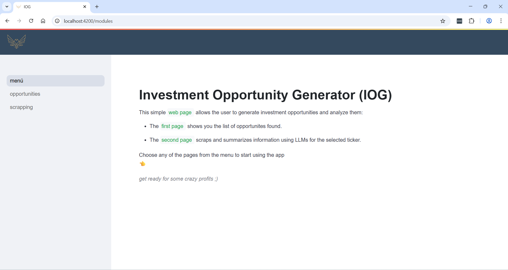

# IOG (Investment Opportunity Generator)
This project aims at showing a web application I developped for investing in the stock market. It includes:
1. Scrapping functions, developed with Python and APIfied with Flask
2. An LLM API using my computer's NVIDIA GPU and hugging-face bart-large-cnn for text summarization
3. An angular application to use said APIs in a visual interactive context


I did not publish my angular code. I did however commit all the python functions and APIs for anyone that whishes to copy or use them. All the functions are correctly commented, including a description, its arguments and its output.  

🎬 Here you can access a demo of the angular app (total of **3mins**, but recommended to play it a 1.5 speed):

<a href="https://youtu.be/LkixjV7Zq2M"></a>

## Reference table

| Section                                                                                                                    | Description |
|-----------------------------------------------------------------------------------------------------------------------------|-------------|
| [Project structure](#project-structure)       | Project structure explanation. |
| [Previous requirements](#previous-requirements)                                                                                   | List of previous requirements needed. |
| [Usage](#usage)       | Usage of the APIs. |


## Project structure

### 1. "APIs" folder
This folder contains all the code to deploy the APIs:
1. scrappers.py: APIs for scrapping, deploy using "python scrappers.py" and available to try with POSTMAN (collection included in this GitHub repo)
2. app.py: API for text summarization (LLM x GPU), deploy using "uvicorn app:app --host 0.0.0.0 --port 5005" and available to try with POSTMAN (collection included in this GitHub repo)

### 2. "Pyfuncs" folder
This folder contains all the developed functions that the API code uses:
1. iog.py: Functions for the investment opportunity section of the app
2. press_releases.py: Functions to scrapp the information related to yahoo finance press releases
3. summarizer.py: Functions related to the text summarization API
4. tickernerd.py: Functions to scrapp information for a given ticker in both tickernerd and danelfin


### 3. Other files
1. chromedriver.exe: Chromedriver used by danelfin and to instantiate with the undetected chromedriver library ("start_driver_undetected" in "press_releases.py"). Make sure your chrome version is compatible with this driver version (142).
2. IOG.postman_collection.json: POSTMAN collection so that you can try your APIs when deployed

## Previous requirements

### 1. Conda
We will use a conda environment called "iog".
- In order to create it:
```bash
conda create --name iog python=3.10.19
conda activate iog
conda install -n iog ipykernel --update-deps --force-reinstall
```
 - This environment will require the following installations:
    - flask
    - selenium
    - pandas
    - webdriver-manager
    - bs4
    - yfinance
    - undetected-chromedriver
    - uvicorn

### 2. CUDA
You will need to have an NVIDIA GPU in your system, and the corresponding driver also installed. Then, make sure you have a matching pyTorch version installed. You can verify if everything works with the following commands:
1. conda activate iog
2. python
3. > ... import torch
4. > ... torch.cuda.is_available()

In my case I had:
- CUDA: cuda_12.8.0_571.96_windows.exe
- torch: 2.9.0+cu128 

If you are not sure which versions to use:
1. Open cmd
2. Type nvidia-smi
3. Search for your corresponding NVIDIA DRIVER 
4. Download and install the CUDA TOOLKIT: (ex: https://developer.nvidia.com/cuda-12-8-0-download-archive?target_os=Windows&target_arch=x86_64&target_version=11&target_type=exe_local)
5. Search for the corresponding pyTorch version and install it inside your conda environment

### 3. Paths and credentials
1. Some lines of code use paths, and will hence fail if directly executed. Beware of this and correct it using the adequate paths within your computer
2. A lot of functions use "credentials.py", mostly for proxy credentials setting. Create a file as follows and set it up with your credentials information:

    ```bash
    class Credentials:
        http_proxy:str = "http://..."
        https_proxy:str = "http://..."
        proxy_server: str = "...

## Usage
1. Make sure everything is correctly set up. (See requirements section).
2. Deploy the APIs (see "Project structure", "APIs Folder").
3. Open POSTMAN and load the collection (all scrapping functions will actually open a chrome driver when executed):
    - a. Use **GENERATE_OPPORTUNITIES** to create your winners.json file. Since it takes a while (approx 2 mins), the idea is that it should be executed once a day with a job, and then the results can be readed directly at any time using **READ_OPPORTUNITIES**
    - b. Use **LOAD_TICKERS_IN_OTHERS** to get, for a given ticker: its company summary, tickernerd investment strategy, danelfin investment strategy and a foto of its chart
    - c. Use **GET_PRESS_RELEASES** to get, for a given ticker, a list with 5 press releases by month from all available yahoo finance press releases for that ticker
    - d. Use **SCRAP_PRESS_RELEASES** to get, for a list of URLS, its scrapped content
    - e. Use **SUMMARIZER** to get, for a given text, its summarized version (using a hugging-face-LLM through your GPU)